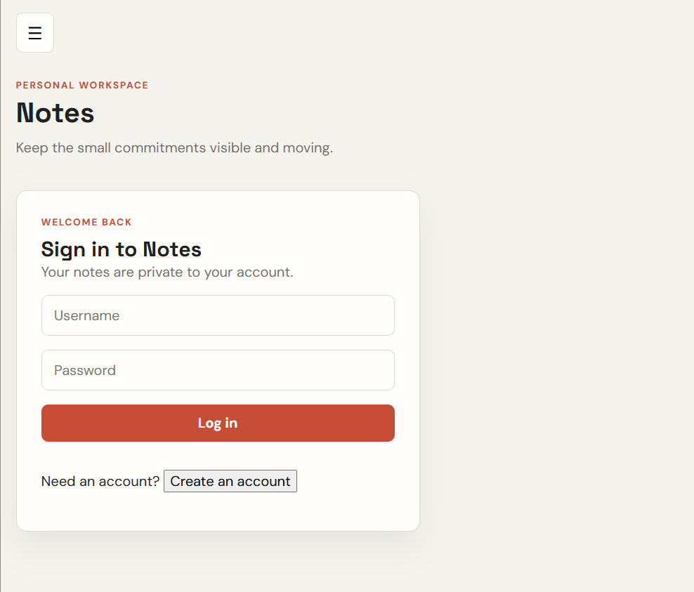
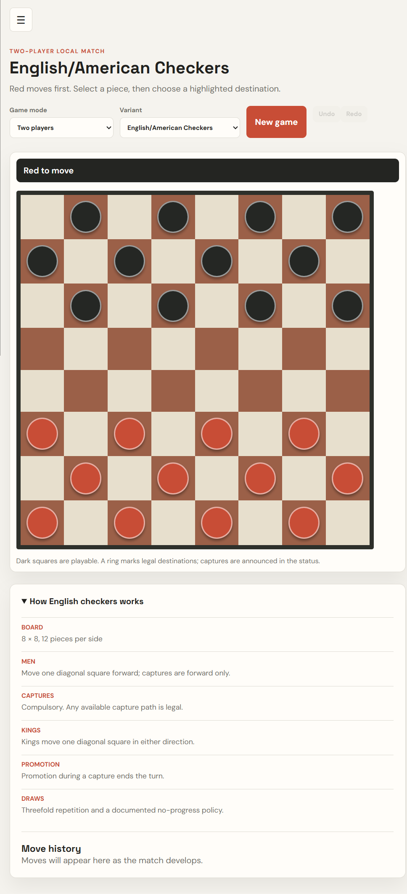

# Task & Games Hub

Task & Games Hub is a .NET 9 application that combines private notes with a playable checkers workspace in one responsive React interface.

The repository is a .NET solution first. The React/Vite frontend is the browser client for the ASP.NET Core API and the shared product shell.

## Features

- Authenticated, owner-scoped notes and tasks.
- JWT authentication with stable user ID claims.
- SQLite persistence through Entity Framework Core.
- English/American Checkers on an 8x8 board.
- International Draughts on a 10x10 board.
- Compulsory captures, multi-capture paths, promotion, flying kings, and variant-specific capture rules.
- Keyboard-accessible board cells and responsive navigation.
- Centralized frontend API requests with cancellation and timeouts.

## Solution Structure

| Project | Purpose |
| --- | --- |
| `TodoApi` | ASP.NET Core 9 API for authentication and notes. |
| `Shared` | EF Core entities, `TodoDbContext`, and database migrations. |
| `TodoApp` | .NET console client using the shared persistence model. |
| `Checkers.Core` | Framework-independent canonical C# checkers domain. |
| `CheckersGame` | ASP.NET Core checkers adapter over `Checkers.Core`. |
| `hub-frontend` | React 19 and Vite browser application. |

The canonical checkers rules are in `Checkers.Core`. UI code should not be treated as a second server-side rules authority.

## Prerequisites

Install the following before running the application:

- .NET SDK 9.0 or later
- Node.js 20 or later and npm
- Git

Verify the .NET installation:

```powershell
 dotnet --version
```

## Configuration

The API requires JWT settings at startup. The repository includes development placeholders, but real secrets should be supplied through user secrets or environment variables.

From the repository root:

```powershell
dotnet user-secrets init --project TodoApi\TodoApi.csproj
dotnet user-secrets set "Jwt:key" "replace-with-a-long-development-secret" --project TodoApi\TodoApi.csproj
```

The key must be at least 32 characters. The API also reads:

- `Jwt:issuer`
- `Jwt:audience`
- `ConnectionStrings:Todos`
- `Cors:Origins`

The default development API URL is `http://localhost:5086`. The frontend uses that URL unless `VITE_API_BASE_URL` is set.

## Database Setup

The API does not create or migrate the database automatically at startup. Apply the EF Core migration deliberately:

```powershell
dotnet ef database update `
  --project Shared\Shared.csproj `
  --startup-project TodoApi\TodoApi.csproj
```

The migration creates the users table, normalized username constraint, owner-scoped todo relationship, and todo indexes.

For an existing database created by the old `EnsureCreated()` workflow, read [MIGRATIONS.md](MIGRATIONS.md) before applying the migration. Do not apply the initial migration directly to a legacy database without backing it up and deciding how existing notes should be assigned to users.

## Run the Application

Use separate terminals from the repository root.

### 1. Restore and build the .NET solution

```powershell
dotnet restore TaskAndGamesHub.sln
dotnet build TaskAndGamesHub.sln --configuration Release
```

### 2. Apply the database migration

```powershell
dotnet ef database update `
  --project Shared\Shared.csproj `
  --startup-project TodoApi\TodoApi.csproj
```

### 3. Start the .NET API

```powershell
dotnet run --project TodoApi\TodoApi.csproj --launch-profile http
```

The API is available at `http://localhost:5086`. Swagger is available at `http://localhost:5086/swagger` in Development.

### 4. Install and start the React client

```powershell
npm --prefix hub-frontend ci
npm --prefix hub-frontend run dev
```

Open the Vite URL shown in the terminal, normally `http://localhost:5173`.

To use another API URL:

```powershell
$env:VITE_API_BASE_URL = "http://localhost:5086/api"
npm --prefix hub-frontend run dev
```

Register an account in Notes before creating or completing notes. Notes are only returned to their authenticated owner.

## Using the Application

### Open the application

After the frontend starts, open:

```text
http://localhost:5173/
```

The root route opens **Notes**. You can also navigate directly to:

- `http://localhost:5173/todo` for Notes.
- `http://localhost:5173/checkers` for the Checkers workspace.

The dark sidebar is the main application switcher. Select **Notes** or **Checkers** to move between features. On smaller screens, select the menu button to open the navigation drawer, then close it with the backdrop, the close action, or the `Escape` key.

### Use Notes

1. Select **Create an account** on the Notes screen.
2. Enter a username and a password of at least 10 characters.
3. Sign in with the new account.
4. Enter a note in the input field and select **Add note**.
5. Use **Open**, **Completed**, or **All** to filter the list.
6. Select **Mark done** to complete a note or **Delete** to remove it.
7. Select **Log out** to clear the in-memory session token.

Notes are associated with the signed-in account. The API never trusts an owner ID supplied by the browser.

### Play Checkers

1. Select **Checkers** in the sidebar or open `/checkers` directly.
2. Choose **Two players** to play locally with another person, or choose **Play against computer** to play solo as Red against the deterministic computer opponent.
3. Choose **English/American Checkers** or **International Draughts** from the Variant selector.
4. Changing the mode or variant starts a new game using that selection's rules.
5. Red moves first. Select one of your pieces, then select a highlighted destination square. In computer mode, the status shows **Computer is thinking** briefly before Black responds automatically.
6. The status banner announces whose turn it is and whether a capture is required.
7. Read **How English checkers works** or **How International draughts works** to review the active rules.
8. Use **Undo** to remove the latest turn. In computer mode, this removes your move and the computer's response together. Use **Redo** to restore the undone turn; the computer response is scheduled again after the short thinking delay.
9. Use **New game** to reset the current mode and variant. Recent moves appear in **Move history**.

The board uses buttons rather than drag-only interaction, so it supports mouse, touch, keyboard focus, Enter/Space activation, and screen readers. Legal destinations are shown with a visible ring and are also included in each square's accessible label.

### Screenshots





## Running the Checkers Adapter

`CheckersGame` is a separate ASP.NET Core adapter over `Checkers.Core`:

```powershell
dotnet run --project CheckersGame\CheckersGame.csproj
```

Its default URLs are configured by the project and may differ from the Todo API. The browser application currently provides the interactive local game workspace through its checkers presentation adapter; the C# domain remains the canonical rules implementation for server-side validation and future session endpoints.

## Useful Commands

```powershell
# Build all .NET projects
dotnet build TaskAndGamesHub.sln --configuration Release

# Run solution tests
dotnet test TaskAndGamesHub.sln --configuration Release

# Check frontend quality
npm --prefix hub-frontend run lint

# Create a production frontend bundle
npm --prefix hub-frontend run build
```

There are currently no dedicated automated test projects in the solution, so `dotnet test` validates the solution and reports test-project discovery when none are present.

## Supported Checkers Variants

### English/American Checkers

- 8x8 board with 12 pieces per side.
- Men capture forward only.
- Kings move one diagonal square in either direction.
- Captures are compulsory, but any legal capture path may be chosen.
- Promotion during a capture ends the turn.

### International Draughts

- 10x10 board with 20 pieces per side.
- Men may capture forward or backward.
- Kings are flying kings.
- Captures are compulsory and the maximum-capture path is required.
- Promotion is applied after the complete capture sequence.
- Advanced FMJD draw counters are deferred; the UI labels this limitation.

Unsupported variants such as Brazilian and Russian draughts are not presented as playable.

## Security Notes

- Todo queries are filtered by the authenticated user ID, never by browser-supplied ownership data.
- Request DTOs validate note titles server-side.
- Passwords are hashed with BCrypt and a configured work factor.
- JWT issuer, audience, lifetime, signature, and algorithm are validated.
- CORS uses an explicit origin allowlist.
- Tokens are kept in frontend memory and are not written to `localStorage`.
- Never commit production JWT keys, passwords, database files, or tokens.

## Project Documentation

- [Architecture map](ARCHITECTURE.md)
- [Database migration instructions](MIGRATIONS.md)
- [Frontend package documentation](hub-frontend/README.md)
